# Application Bancaire Numérique

## Introduction

Cette application bancaire numérique représente une solution complète développée avec **Java Spring Boot** pour le backend et **Angular** pour le frontend. Elle démontre l'implémentation d'une architecture moderne pour la gestion des opérations bancaires sécurisées, développée dans le cadre de mon apprentissage Java Spring Boot.

### Fonctionnalités Principales

- **Gestion Complète des Clients** : CRUD avec recherche avancée et pagination
- **Comptes Bancaires Multiples** : Support des comptes courants et d'épargne
- **Opérations Sécurisées** : Débits, crédits et virements avec validation métier
- **Authentification JWT** : Sécurité robuste avec gestion des rôles (RBAC)
- **Dashboard Analytique** : Visualisations interactives avec Chart.js
- **Interface Moderne** : Design responsive avec Bootstrap 5 et composants personnalisés

### Technologies Utilisées

#### Backend
- **Java 17** + **Spring Boot 3.4.5**
- **Spring Security** avec JWT
- **Spring Data JPA** + **Hibernate**
- **Base de données H2** (développement) + **MySQL** (production)
- **Maven** pour la gestion des dépendances
- **Swagger/OpenAPI 3** pour la documentation API
- **Lombok** pour la réduction du code boilerplate

#### Frontend
- **Angular 19.2.0** avec **TypeScript 5.7.2**
- **Bootstrap 5.3.2** pour l'UI et le responsive design
- **Chart.js 4.4.9** avec **ng2-charts 8.0.0** pour les visualisations
- **RxJS 7.8.0** pour la programmation réactive
- **Angular Standalone Components** (architecture moderne)

---

## Architecture et Technologies

### Architecture Frontend Moderne

L'application utilise l'**architecture Angular Standalone Components** (Angular 19) pour une meilleure modularité :

```typescript
@Component({
  selector: 'app-dashboard',
  standalone: true,
  imports: [CommonModule, RouterModule, LoadingSpinnerComponent, BaseChartDirective],
  templateUrl: './dashboard.component.html',
  styleUrl: './dashboard.component.css'
})
export class DashboardComponent implements OnInit {
  // Logique du composant...
}
```

**Technologies Frontend Clés :**
- **Angular 19.2.0** avec Standalone Components
- **TypeScript 5.7.2** pour le typage fort
- **Bootstrap 5.3.2** via CDN pour l'UI
- **Bootstrap Icons** pour l'iconographie
- **Chart.js 4.4.9** avec ng2-charts 8.0.0
- **RxJS 7.8.0** pour la gestion d'état réactive

---

## Installation et Configuration

### Prérequis

- **Java 17+** 
- **Node.js 18+** et **npm**
- **Git** pour le clonage du repository
- **IDE recommandé** : IntelliJ IDEA ou VS Code

### Installation Backend

```bash
# Cloner le repository
git clone https://github.com/youssef-amazzal/digital-banking-backend
cd digital-banking-backend

# Installer les dépendances Maven
mvn clean install

# Lancer l'application
mvn spring-boot:run
```

Le backend sera accessible sur : `http://localhost:8080`

### Installation Frontend

```bash
# Cloner le repository
git clone https://github.com/youssef-amazzal/digital-banking-ui
cd digital-banking-backend

# Installer les dépendances npm
npm install

# Lancer l'application Angular
npm start
```
npm install

# Lancer l'application Angular
Le frontend sera accessible sur : `http://localhost:4200`

### Configuration de Base

**application.properties** :
```properties
# Base de données H2
spring.datasource.url=jdbc:h2:mem:bankdb
spring.datasource.username=admin
spring.datasource.password=admin
spring.h2.console.enabled=true
spring.h2.console.path=/h2-console

# JPA/Hibernate Configuration
spring.jpa.database-platform=org.hibernate.dialect.H2Dialect
spring.jpa.hibernate.ddl-auto=update
spring.jpa.show-sql=true

# JWT Configuration
app.jwtSecret=digitalBankingSecretKeyForJWTAuthentication2024
app.jwtExpirationMs=86400000
app.jwtRefreshExpirationMs=604800000
```

---

## Interfaces et Captures d'Écran

### 1. Page de Connexion


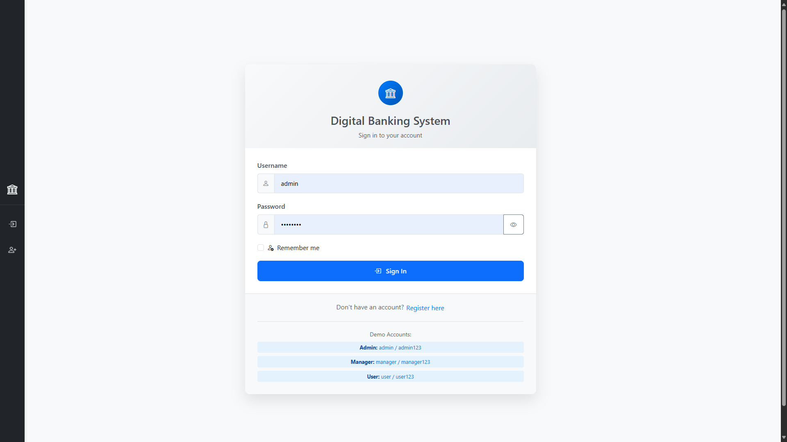


**Description de l'interface :**
- **Formulaire sécurisé** avec validation temps réel
- **Champs de saisie** : Nom d'utilisateur et mot de passe
- **Bouton de connexion** avec indicateur de chargement
- **Messages d'erreur** contextuels en cas d'échec
- **Design responsive** s'adaptant à tous les écrans

**Fonctionnalités :**
- Validation côté client avec Angular Reactive Forms
- Gestion des erreurs d'authentification
- Redirection automatique selon le rôle utilisateur
- Protection contre les attaques par force brute

### 2. Dashboard Principal


<div align="center">
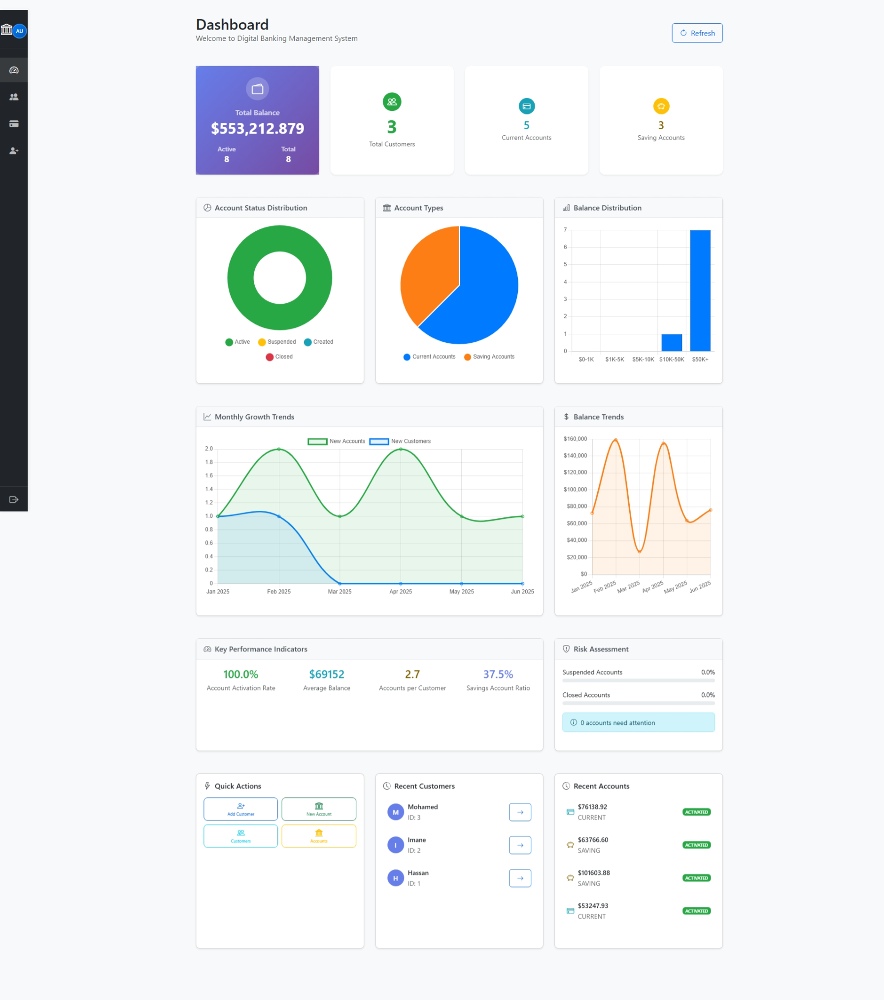
</div>

**Description de l'interface :**
- **KPIs bancaires** : Nombre de clients, comptes total, solde global
- **Graphiques interactifs** : Répartition des types de comptes, évolution temporelle
- **Widgets informatifs** : Comptes récents, opérations du jour
- **Navigation rapide** : Accès direct aux fonctionnalités principales

**Visualisations disponibles :**
- **Graphique en donut** : Distribution des statuts de comptes
- **Histogramme** : Répartition des soldes par tranches
- **Courbes temporelles** : Évolution du nombre de comptes et opérations
- **Cartes de résumé** : Métriques clés en temps réel

### 3. Interface Swagger UI


<div align="center">
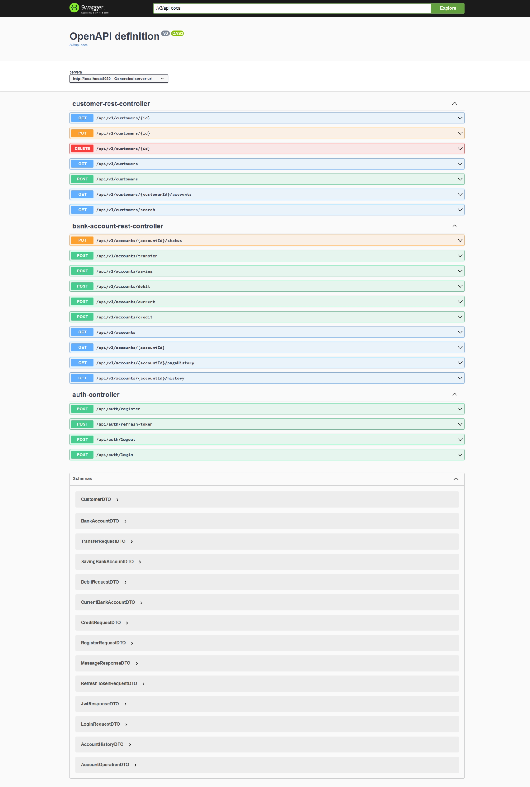
</div>

**Description de l'interface :**
- **Documentation API complète** : Tous les endpoints disponibles
- **Interface de test interactive** : Exécution directe des requêtes
- **Schémas de données** : Modèles d'entrée et de sortie détaillés
- **Authentification JWT** : Support des tokens d'autorisation

**Sections principales :**
- **Customer Controller** : Gestion des clients (CRUD)
- **Bank Account Controller** : Opérations sur les comptes
- **Auth Controller** : Authentification et gestion des tokens
- **Operation Controller** : Historique des transactions

### 4. Console H2 Database

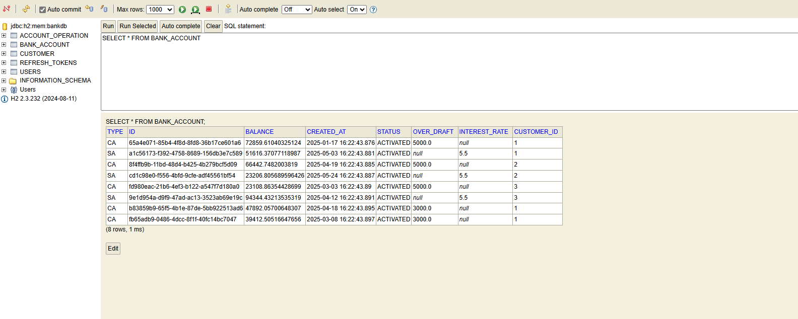


**Description de l'interface :**
- **Connexion à la base** : Interface web pour accéder à H2
- **Explorateur de tables** : Structure de la base de données
- **Éditeur SQL** : Exécution de requêtes personnalisées
- **Visualisation des données** : Inspection des enregistrements

**Utilisation :**
- URL d'accès : `http://localhost:8080/h2-console`
- JDBC URL : `jdbc:h2:mem:bankdb`
- Username : `admin` / Password : `admin`

### 5. Gestion des Clients

<table>
  <tr>
    <td>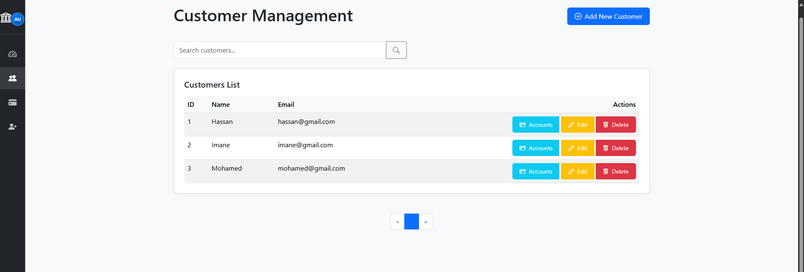</td>
    <td>Gestion des Clients</td>
  </tr>
  <tr>
    <td>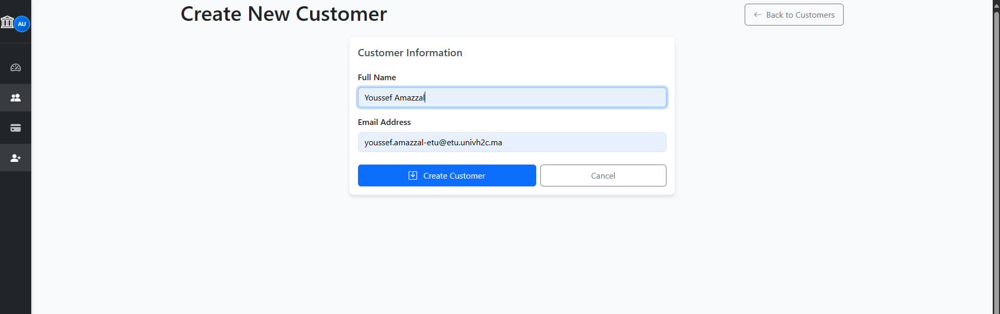</td>
    <td>Formulaire d'ajout de Client</td>
  </tr>
  <tr>
    <td>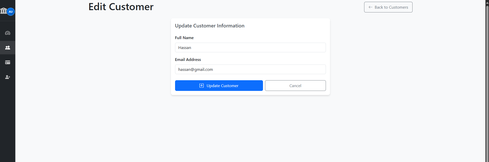</td>
    <td>Formulaire de modification de Client</td>
  </tr>
  <tr>
    <td>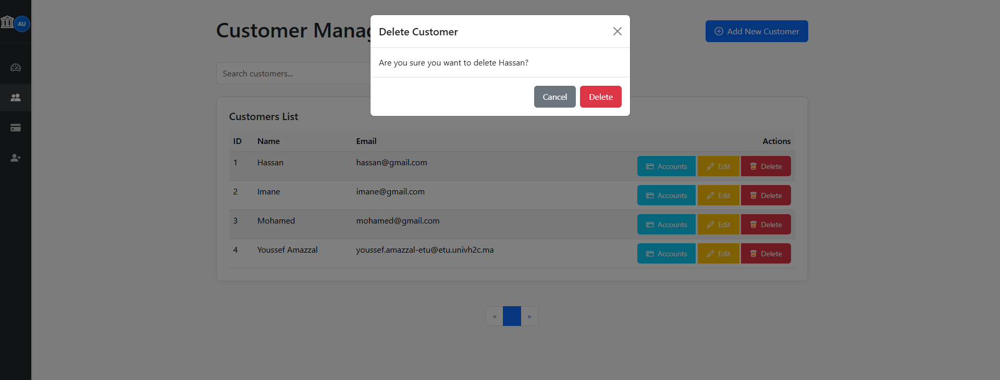</td>
    <td>Message de confirmation de suppression de Client</td>
  </tr>  
</table>

**Description de l'interface :**
- **Liste paginée** : Affichage optimisé avec 10 clients par page
- **Barre de recherche** : Filtrage en temps réel par nom ou email
- **Actions rapides** : Boutons d'édition, suppression, et consultation
- **Formulaire d'ajout** : Modal pour créer de nouveaux clients

**Fonctionnalités avancées :**
- **Recherche intelligente** : Correspondance partielle insensible à la casse
- **Tri multi-colonnes** : Par nom, email, date de création
- **Validation en temps réel** : Vérification de l'unicité des emails
- **Historique des modifications** : Traçabilité des changements

### 6. Détails d'un Client

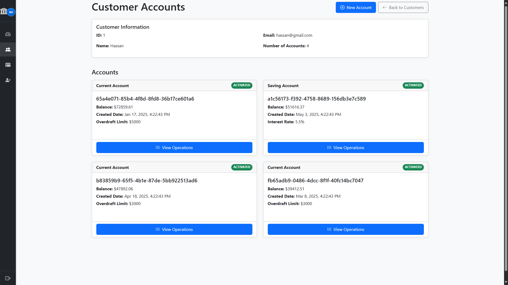

**Description de l'interface :**
- **Informations personnelles** : Nom, email, téléphone, adresse
- **Liste des comptes** : Tous les comptes bancaires du client
- **Résumé financier** : Solde total, nombre de comptes, statut
- **Actions disponibles** : Modifier, ajouter un compte, historique

**Données affichées :**
- **Profil client** : Informations de contact et identification
- **Portfolio bancaire** : Répartition entre comptes courants et épargne
- **Statut global** : Santé financière et alertes éventuelles
- **Historique relationnel** : Date de création, dernière activité

### 7. Création de Compte Bancaire

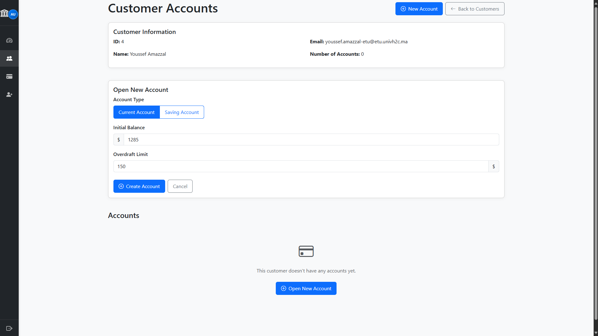

**Description de l'interface :**
- **Sélection du type** : Compte courant ou compte d'épargne
- **Paramètres spécifiques** : Découvert autorisé ou taux d'intérêt
- **Solde initial** : Montant de première versement
- **Validation des règles** : Contrôles métier en temps réel

**Types de comptes :**
- **Compte Courant** : Avec découvert autorisé paramétrable
- **Compte Épargne** : Avec taux d'intérêt configurable
- **Statut initial** : CRÉÉ en attente d'activation
- **Identifiant unique** : Généré automatiquement

### 8. Opérations Bancaires

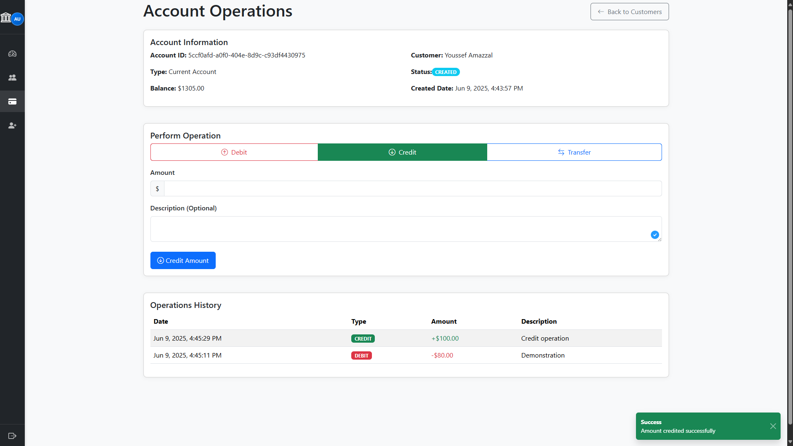

**Description de l'interface :**
- **Sélection de l'opération** : Débit, crédit ou virement
- **Validation du montant** : Contrôles de limites et solde
- **Description obligatoire** : Motif de l'opération
- **Confirmation sécurisée** : Double validation pour gros montants

**Types d'opérations :**
- **Débit** : Retrait avec vérification du solde disponible
- **Crédit** : Dépôt sans limite de montant
- **Virement** : Transfert entre deux comptes avec atomicité
- **Historique temps réel** : Mise à jour immédiate des soldes

### 9. Historique des Opérations

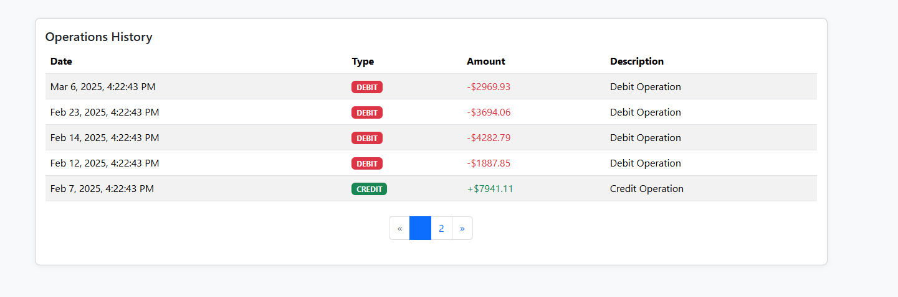

**Description de l'interface :**
- **Chronologie inversée** : Opérations les plus récentes en premier
- **Détails complets** : Date, montant, type, description, solde résultant
- **Pagination optimisée** : 5 opérations par page pour performance
- **Filtrage par période** : Sélection de plages de dates

**Informations affichées :**
- **Date et heure** : Horodatage précis de l'opération
- **Type d'opération** : DÉBIT (rouge) ou CRÉDIT (vert)
- **Montant** : Valeur de la transaction avec formatage monétaire
- **Solde après opération** : État du compte après transaction

### 10. Gestion des comptes bancaires
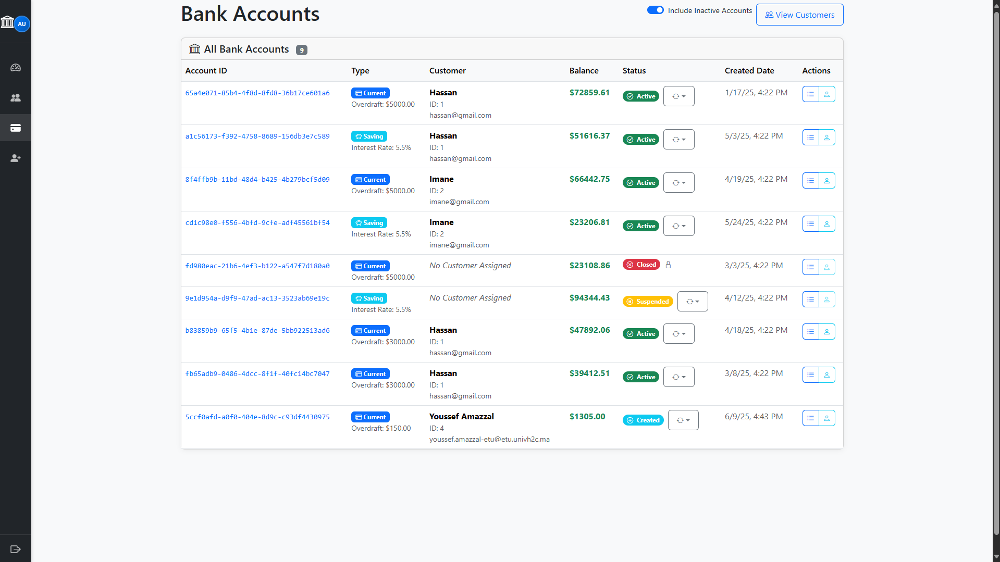

**Description de l'interface :**
- **Liste des comptes** : Affichage de tous les comptes bancaires
- **Actions disponibles** : Voir les opérations, voie le client associé, changer le statut, afficher les comptes inactifs

## Vue d'Ensemble du Projet

### Architecture Système

Ce projet suit une architecture 3-tiers classique que j'ai apprise dans mon cours Spring Boot :

```
Frontend (Angular) -> API REST (Contrôleurs Spring) -> Services -> Repositories -> Base de Données
```

L'application est organisée en plusieurs couches :

1. **Couche Présentation** : Frontend Angular et contrôleurs REST
2. **Couche Métier** : Classes de service implémentant la logique métier
3. **Couche Accès Données** : Interfaces repository et entités JPA

Cette approche en couches m'a aidé à mieux organiser mon code et à séparer les préoccupations, ce qui était un objectif d'apprentissage clé de ce projet.

### Diagramme de Classes

Voici un modèle simplifié des principales classes de l'application :


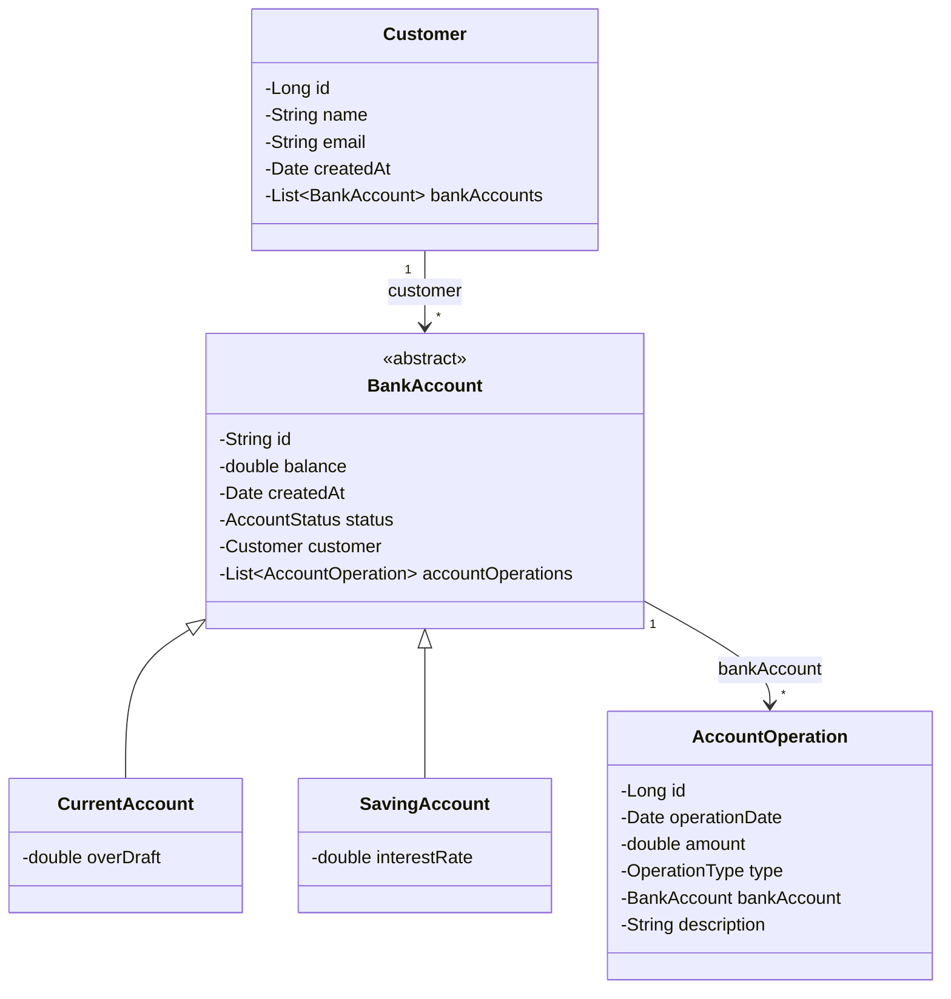

## Étapes d'Implémentation

J'ai construit ce projet étape par étape en suivant le matériel de cours. Voici comment j'ai procédé :

### 1. Couche Entités

D'abord, j'ai créé les entités JPA pour modéliser notre domaine :

```java
@Entity
@Inheritance(strategy = InheritanceType.SINGLE_TABLE)
@DiscriminatorColumn(name = "TYPE", length = 4)
@Data @NoArgsConstructor @AllArgsConstructor
public abstract class BankAccount {
    @Id
    private String id;
    private double balance;
    private Date createdAt;
    @Enumerated(EnumType.STRING)
    private AccountStatus status;
    @ManyToOne
    private Customer customer;
    @OneToMany(mappedBy = "bankAccount", fetch = FetchType.LAZY)
    private List<AccountOperation> accountOperations;
}
```

J'ai utilisé l'héritage pour les types de comptes :
- `CurrentAccount` étend BankAccount avec un montant de découvert
- `SavingAccount` étend BankAccount avec un taux d'intérêt

### 2. Couche Repository

Ensuite, j'ai créé les repositories en utilisant Spring Data JPA :

```java
@Repository
public interface CustomerRepository extends JpaRepository<Customer, Long> {
    @Query("select c from Customer c where c.name like :kw")
    List<Customer> searchCustomer(@Param("kw") String keyword);
}

@Repository
public interface BankAccountRepository extends JpaRepository<BankAccount, String> {
    List<BankAccount> findByCustomerId(Long customerId);
}

@Repository
public interface AccountOperationRepository extends JpaRepository<AccountOperation, Long> {
    List<AccountOperation> findByBankAccountId(String accountId);
    Page<AccountOperation> findByBankAccountId(String accountId, Pageable pageable);
}
```

J'ai testé ces repositories en initialisant des données avec CommandLineRunner.

---

### 3. Couche DTO

J'ai créé des objets de transfert de données (DTOs) pour séparer ma représentation API de mon modèle d'entité :

```java
@Data
public class CustomerDTO {
    private Long id;
    private String name;
    private String email;
}

@Data
public class BankAccountDTO {
    private String id;
    private double balance;
    private Date createdAt;
    private AccountStatus status;
    private CustomerDTO customerDTO;
    private String type;
}

@Data
public class CurrentBankAccountDTO extends BankAccountDTO {
    private double overDraft;
}

@Data
public class SavingBankAccountDTO extends BankAccountDTO {
    private double interestRate;
}

@Data 
public class AccountOperationDTO {
    private Long id;
    private Date operationDate;
    private double amount;
    private OperationType type;
    private String description;
}
```

### 4. Couche Mapper

Pour le mapping entre entités et DTOs, j'ai créé des classes mapper simples :

```java
@Service
public class BankAccountMapperImpl {
    public CustomerDTO fromCustomer(Customer customer) {
        CustomerDTO customerDTO = new CustomerDTO();
        BeanUtils.copyProperties(customer, customerDTO);
        return customerDTO;
    }
    
    // Plus de méthodes de mapping pour les autres entités
    // ...
}
```

J'ai appris que les mappers aident à maintenir la séparation entre le modèle de base de données et le modèle API, facilitant leur évolution indépendante.

### 5. Couche Service

La couche service implémente la logique métier de l'application :

```java
public interface BankAccountService {
    CustomerDTO saveCustomer(CustomerDTO customerDTO);
    CustomerDTO updateCustomer(CustomerDTO customerDTO);
    void deleteCustomer(Long customerId);
    CurrentBankAccountDTO saveCurrentBankAccount(double initialBalance, double overDraft, Long customerId);
    SavingBankAccountDTO saveSavingBankAccount(double initialBalance, double interestRate, Long customerId);
    List<CustomerDTO> listCustomers();
    BankAccountDTO getBankAccount(String accountId);
    void debit(String accountId, double amount, String description);
    void credit(String accountId, double amount, String description);
    void transfer(String accountIdSource, String accountIdDestination, double amount);
    List<BankAccountDTO> bankAccountList();
    List<AccountOperationDTO> accountHistory(String accountId);
    AccountHistoryDTO getAccountHistory(String accountId, int page, int size);
    List<CustomerDTO> searchCustomers(String keyword);
}
```

Implémentation :

```java
@Service
@Transactional
public class BankAccountServiceImpl implements BankAccountService {
    private CustomerRepository customerRepository;
    private BankAccountRepository bankAccountRepository;
    private AccountOperationRepository accountOperationRepository;
    private BankAccountMapperImpl dtoMapper;
    
    @Override
    public void debit(String accountId, double amount, String description) {
        BankAccount bankAccount = bankAccountRepository.findById(accountId)
            .orElseThrow(() -> new BankAccountNotFoundException("Compte non trouvé"));
        
        if(bankAccount.getBalance() < amount) {
            throw new BalanceNotSufficientException("Solde insuffisant");
        }
        
        AccountOperation accountOperation = new AccountOperation();
        accountOperation.setType(OperationType.DEBIT);
        accountOperation.setAmount(amount);
        accountOperation.setDescription(description);
        accountOperation.setOperationDate(new Date());
        accountOperation.setBankAccount(bankAccount);
        accountOperationRepository.save(accountOperation);
        
        bankAccount.setBalance(bankAccount.getBalance() - amount);
        bankAccountRepository.save(bankAccount);
    }
    
    // Autres méthodes du service...
}
```

Cette couche gère la logique métier principale comme :
- Valider et effectuer les transactions (débits et crédits)
- S'assurer du solde suffisant pour les retraits
- Gérer les clients et les comptes

### 6. Couche Contrôleur REST

Finalement, j'ai créé les contrôleurs REST pour exposer mes endpoints API :

```java
@RestController
@CrossOrigin("*")
public class BankAccountRestController {
    private BankAccountService bankAccountService;

    @GetMapping("/accounts/{accountId}")
    public BankAccountDTO getBankAccount(@PathVariable String accountId) {
        return bankAccountService.getBankAccount(accountId);
    }

    @GetMapping("/accounts")
    public List<BankAccountDTO> listAccounts() {
        return bankAccountService.bankAccountList();
    }

    @PostMapping("/accounts/debit")
    public DebitDTO debit(@RequestBody DebitDTO debitDTO) {
        this.bankAccountService.debit(debitDTO.getAccountId(), debitDTO.getAmount(), debitDTO.getDescription());
        return debitDTO;
    }

    @PostMapping("/accounts/credit")
    public CreditDTO credit(@RequestBody CreditDTO creditDTO) {
        this.bankAccountService.credit(creditDTO.getAccountId(), creditDTO.getAmount(), creditDTO.getDescription());
        return creditDTO;
    }

    @PostMapping("/accounts/transfer")
    public void transfer(@RequestBody TransferRequestDTO transferRequestDTO) {
        this.bankAccountService.transfer(
                transferRequestDTO.getAccountSource(),
                transferRequestDTO.getAccountDestination(),
                transferRequestDTO.getAmount());
    }
}
```

J'ai créé des contrôleurs séparés pour différents types de ressources :
- `CustomerRestController` pour la gestion des clients
- `BankAccountRestController` pour les opérations de compte
- `OperationRestController` pour l'historique des transactions

### 7. Gestion des Exceptions

J'ai implémenté des exceptions personnalisées pour une meilleure gestion des erreurs :

```java
@ResponseStatus(HttpStatus.NOT_FOUND)
public class CustomerNotFoundException extends RuntimeException {
    public CustomerNotFoundException(String message) {
        super(message);
    }
}

@ResponseStatus(HttpStatus.BAD_REQUEST)
public class BalanceNotSufficientException extends RuntimeException {
    public BalanceNotSufficientException(String message) {
        super(message);
    }
}
```

Et un gestionnaire global d'exceptions :

```java
@ControllerAdvice
public class GlobalExceptionHandler {
    @ExceptionHandler(CustomerNotFoundException.class)
    public ResponseEntity<String> handleCustomerNotFoundException(CustomerNotFoundException ex) {
        return new ResponseEntity<>(ex.getMessage(), HttpStatus.NOT_FOUND);
    }
    
    // Autres gestionnaires d'exceptions...
}
```

## Sécurité et Authentification

### Architecture de Sécurité Multicouches

L'application implémente une **sécurité défensive en profondeur** avec plusieurs niveaux de protection :

#### 1. Authentification JWT Robuste

```java
@Configuration
@EnableWebSecurity
@EnableMethodSecurity(prePostEnabled = true)
public class SecurityConfig {
    
    @Bean
    public SecurityFilterChain filterChain(HttpSecurity http) throws Exception {
        return http
            .cors(Customizer.withDefaults())
            .csrf(csrf -> csrf.disable()) // Protection CSRF via JWT
            .sessionManagement(session -> session.sessionCreationPolicy(STATELESS))
            .authorizeHttpRequests(auth -> auth
                .requestMatchers("/api/auth/**").permitAll()
                .requestMatchers("/h2-console/**").permitAll()
                .requestMatchers("/swagger-ui/**", "/v3/api-docs/**").permitAll()
                .requestMatchers(HttpMethod.GET, "/api/customers/**").hasAnyRole("ADMIN", "MANAGER")
                .requestMatchers(HttpMethod.POST, "/api/accounts/**").hasRole("ADMIN")
                .anyRequest().authenticated()
            )
            .addFilterBefore(jwtAuthenticationFilter(), UsernamePasswordAuthenticationFilter.class)
            .build();
    }
}
```

**Caractéristiques de sécurité :**
- **Tokens JWT** avec signature HS512
- **Durée de vie courte** (24h) pour limiter l'exposition
- **Refresh tokens** (7 jours) pour l'expérience utilisateur
- **Révocation côté serveur** pour sécurité maximale

#### 2. Système RBAC (Role-Based Access Control)

**Hiérarchie des rôles :**
- **USER** : Consultation de ses propres données
- **MANAGER** : Gestion des clients et opérations courantes
- **ADMIN** : Accès complet et configuration système

```java
@PreAuthorize("hasRole('ADMIN')")
public void deleteCustomer(Long customerId) { /* ... */ }

@PreAuthorize("hasRole('ADMIN') or hasRole('MANAGER')")
public List<CustomerDTO> listCustomers() { /* ... */ }
```

#### 3. Protection Frontend avec Guards

```typescript
@Injectable()
export class AuthGuard implements CanActivate {
  constructor(
    private authService: AuthService, 
    private router: Router,
    private notificationService: NotificationService
  ) {}

  canActivate(route: ActivatedRouteSnapshot): boolean {
    if (this.authService.isAuthenticated()) {
      return true;
    }
    
    this.authService.redirectUrl = route.url.join('/');
    this.notificationService.warn('Veuillez vous connecter pour accéder à cette page');
    this.router.navigate(['/auth/login']);
    return false;
  }
}

@Injectable()
export class RoleGuard implements CanActivate {
  constructor(
    private authService: AuthService,
    private router: Router,
    private notificationService: NotificationService
  ) {}
  
  canActivate(route: ActivatedRouteSnapshot): boolean {
    const requiredRoles = route.data['roles'] as string[];
    const userRole = this.authService.getUserRole();
    
    if (!requiredRoles || requiredRoles.includes(userRole)) {
      return true;
    }
    
    this.notificationService.error(
      `Accès refusé: Vous avez besoin d'un rôle ${requiredRoles.join(' ou ')} pour accéder à cette page`
    );
    this.router.navigate(['/dashboard']);
    return false;
  }
}
```

### Validation Métier et Contraintes

#### Validation des Opérations Bancaires

```java
@Service
@Transactional
public class BankAccountServiceImpl {
    
    public void debit(String accountId, double amount, String description) {
        BankAccount account = findAccount(accountId);
        
        // Validation métier
        if (amount <= 0) {
            throw new InvalidOperationException("Le montant doit être positif");
        }
        
        if (account.getStatus() != AccountStatus.ACTIVATED) {
            throw new AccountNotActiveException("Compte non actif");
        }
        
        // Vérification solde + découvert autorisé
        double availableBalance = account.getBalance();
        if (account instanceof CurrentAccount) {
            availableBalance += ((CurrentAccount) account).getOverDraft();
        }
        
        if (availableBalance < amount) {
            throw new BalanceNotSufficientException("Solde insuffisant");
        }
        
        // Exécution sécurisée
        performDebit(account, amount, description);
        auditLog.logOperation("DEBIT", accountId, amount, getCurrentUser());
    }
}
```

### Gestion Avancée des Tokens JWT

#### Cycle de Vie Complet des Tokens

```java
@Component
public class JwtUtils {
    
    @Value("${app.jwtSecret}")
    private String jwtSecret;
    
    @Value("${app.jwtExpirationMs}")
    private int jwtExpirationMs;
    
    public String generateJwtToken(Authentication authentication) {
        UserDetailsImpl userPrincipal = (UserDetailsImpl) authentication.getPrincipal();
        
        return Jwts.builder()
                .setSubject(userPrincipal.getUsername())
                .setIssuedAt(new Date())
                .setExpiration(new Date(System.currentTimeMillis() + jwtExpirationMs))
                .claim("role", userPrincipal.getAuthorities().iterator().next().getAuthority())
                .claim("userId", userPrincipal.getId())
                .signWith(SignatureAlgorithm.HS512, jwtSecret)
                .compact();
    }
    
    public boolean validateJwtToken(String authToken) {
        try {
            Jwts.parser().setSigningKey(jwtSecret).parseClaimsJws(authToken);
            return true;
        } catch (SignatureException e) {
            logger.error("Signature JWT invalide: {}", e.getMessage());
        } catch (MalformedJwtException e) {
            logger.error("Token JWT malformé: {}", e.getMessage());
        } catch (ExpiredJwtException e) {
            logger.info("Token JWT expiré: {}", e.getMessage());
        } catch (UnsupportedJwtException e) {
            logger.error("Token JWT non supporté: {}", e.getMessage());
        } catch (IllegalArgumentException e) {
            logger.error("JWT claims vide: {}", e.getMessage());
        }
        return false;
    }
}
```

### Configuration de Sécurité Avancée

#### Variables d'Environnement

```properties
# JWT avec clé forte (configuration sécurisée)
app.jwtSecret=digitalBankingSecretKeyForJWTAuthentication2024

# Durée de vie optimisée pour l'équilibre sécurité/expérience
app.jwtExpirationMs=86400000      # Access Token: 24 heures
app.jwtRefreshExpirationMs=604800000  # Refresh Token: 7 jours
```

#### Utilisateurs Préconfigurés (Développement)

- **admin** / admin123 (ADMIN) - Accès complet au système
- **manager** / manager123 (MANAGER) - Gestion client et opérations
- **user** / user123 (USER) - Consultation des données personnelles

### Audit et Traçabilité

```java
@Slf4j
@Service
public class AuditService {
    
    public void logBankingOperation(String operation, String accountId, 
                                   double amount, String userId) {
        log.info("AUDIT: operation={}, account={}, amount={}, user={}, timestamp={}", 
                operation, accountId, amount, userId, Instant.now());
    }
    
    @EventListener
    public void handleSecurityEvent(SecurityEvent event) {
        log.warn("SECURITY: event={}, user={}, ip={}, timestamp={}", 
                event.getType(), event.getUser(), event.getIpAddress(), 
                event.getTimestamp());
    }
}
```